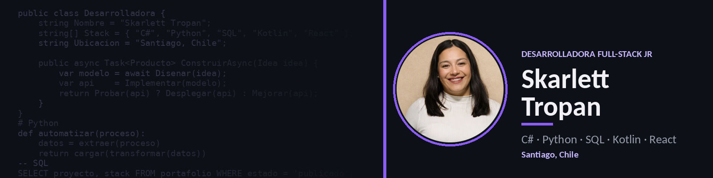

  

    

<h3 align="center">Desarrolladora Full-Stack Jr · C# · Python · SQL · Kotlin · React</h3>

Analista programadora. Sistemas internos, datos y automatización con foco en calidad.

  
  
  

---

## Sobre mí

Soy **Skarlett Tropan**, desarrolladora de software en Santiago, Chile. Técnico Analista Programador (DuocUC) y estudiante de **Ingeniería en Informática**.

En **BanCrece**, cooperativa de ahorro y crédito, desarrollé módulos web en **ASP.NET WebForms (C#)**, diseñé bases de datos en **SQL Server**, participé en una migración a **PostgreSQL** y automaticé procesos ETL con **Python**.

También construyo apps móviles nativas con **Kotlin y Jetpack Compose** y frontends en **React**. Busco oportunidades **híbridas o remotas** como desarrolladora Full-Stack o Backend Jr.

## Stack

<table>
<tr><td><b>Lenguajes</b></td><td>     </td></tr>
<tr><td><b>Backend</b></td><td>  </td></tr>
<tr><td><b>Frontend y Mobile</b></td><td>    </td></tr>
<tr><td><b>Datos</b></td><td>  </td></tr>
<tr><td><b>Herramientas</b></td><td>     </td></tr>
</table>

## Proyectos destacados

| Proyecto | Qué es | Stack | Estado |
|---|---|---|---|
| [**Level Up Gamer**](https://github.com/skarlethtropan8-svg/level-up-gamer-android) | E-commerce gaming Android con API propia, 3 roles, verificación por correo, pagos y mapas. *Portafolio de título.* | Kotlin · Compose · FastAPI · MySQL | ✅ Publicado |
| [**SRE Valle del Sol**](https://github.com/skarlethtropan8-svg/sre-valle-del-sol) | Respuesta a emergencias con microservicios, API Gateway, BFF y panel React. *En equipo.* | Java · Spring Boot · Keycloak · React | ✅ Publicado |
| [**Pastelería Store**](https://github.com/skarlethtropan8-svg/pasteleria-store-android) | App Android con catálogo, carrito, login y perfil. | Kotlin · Compose · Room · Retrofit | ✅ Publicado |
| [**Pastelería Admin**](https://github.com/skarlethtropan8-svg/pasteleria-admin-react) | Panel web de administración de productos y categorías. | React · AdminLTE · Axios | ✅ Publicado |
| [**Lifpool Piscinas**](https://github.com/skarlethtropan8-svg/Lifpool-Piscinas) | Gestión de mantenciones de piscinas para un cliente real. | HTML · JavaScript | 🚧 En desarrollo |

## Experiencia

**Analista Programadora — BanCrece** · Santiago · 2026
Práctica profesional y contratación. Módulos ASP.NET WebForms, diseño de BD en SQL Server, migración a PostgreSQL, ETL en Python y gestión de tareas en Jira.

## Contacto

  
  

Skarlett Tropan · Santiago, Chile · Full-Stack · Backend · Datos

